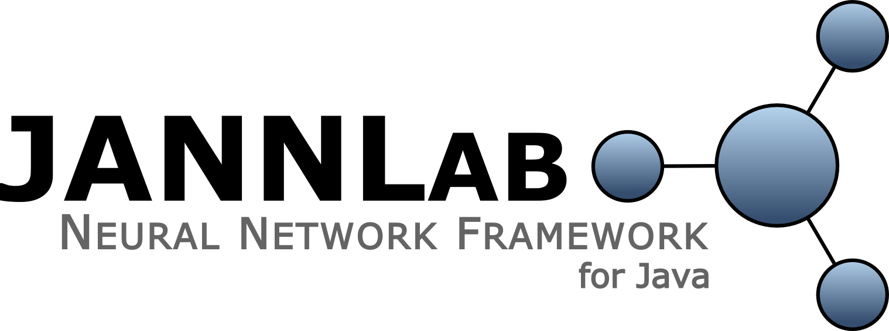

Copyright (C) 2012-2015 Sebastian Otte

## What is JANNLab?

JANNLab is a Java framework for modeling, simulating and application of artificial neural networks. It supports feed forward networks, recurrent networks as well as Long Short-Term Memory networks and bidirectional architectures. The framework provides free modeling but also real-time efficiency. It is compatible with android and is
light-weight, which makes it suitable for mobile device implementations.

If you use JANNLab for your research, please cite the paper:

    @inproceedings{otte_jannlab_2013,
        title     = {JANNLab Neural Network Framework for Java},
        booktitle = {Poster Proceedings Conference {MLDM} 2013},
        publisher = {ibai-publishing},
        author    = {Sebastian Otte and Dirk Krechel and Marcus Liwicki},
        address   = {New York, USA},
        pages     = {39--46},
        year      = {2013}
    }

### License

JANNLab is released under the terms of the GNU General Public License (GPL), version 3 or later. See [http://www.gnu.org/licenses/gpl-3.0.txt](http://www.gnu.org/licenses/gpl-3.0.txt) for details.

## Builds

The following builds contain sources, compiled libs for Java 1.7 and a lot of example code.

[JANNLab 0.10-alpha](https://github.com/JANNLab/JANNLab/blob/master/builds/jannlab-0.10-alpha.tar.gz?raw=true)

